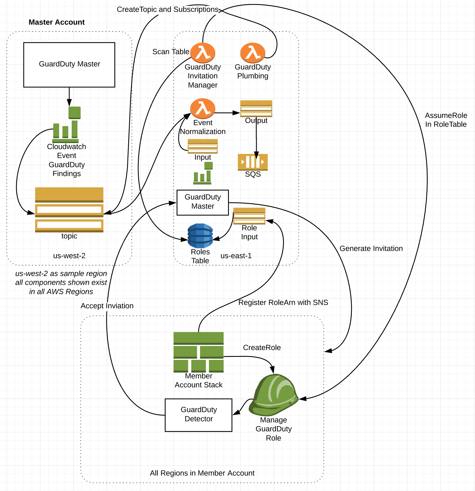

# GuardDuty Multi-Account Manager

Automate the AWS GuardDuty account invitation lifecycle for all of your 
organizations AWS accounts in all regions as well as aggregate and normalize 
the GuardDuty findings

## Architecture

> Above is an example architecture for a master account with a member account. 
> Note: The member account has GuardDuty detectors in every region as does the 
> master account.

## Why This?

As a multi-account user of Amazon Web Services you have a few choices when
deciding to turn on GuardDuty across your accounts.

Your options are:

1. Stack Sets
2. Human invitations
3. Something else.

Due to the nature of stack sets and the distributed governance of Mozilla it
breaks our trust model to grant the needed permissions to run stack sets.
Human behavior consistently generates inconsistent results.

This is why we elected to create GuardDuty Multi-Account Manager

## What is it?

GuardDuty Multi-Account Manager is a series of lambda functions designed to do
the following:

* Enable GuardDuty Masters in all AWS Regions present and future.
* Empower account owners to decide to enable GuardDuty
* Manage the lifecycle of invitations to the member accounts
* Aggregate all findings from all detectors in all regions, normalize the data,
  and send to a single SQS queue

## How do I deploy it?

### Dependencies

* AWS Organizations
  * Either run the GuardDuty Multi-Account Manager from within an AWS
    Organizations parent account or
  * Establish an IAM Role in the AWS Organizations parent account that can be
    assumed by the GuardDuty Multi-Account Manager.
    [Example IAM Role](docs/example-organizations-reader-iam-role.yml)
* Deploy the
  [Cloudformation Cross Account Outputs](https://github.com/mozilla/cloudformation-cross-account-outputs/)
  service which allows CloudFormation stacks in other AWS accounts to report
  back output. This is used to convey the
  [GuardDuty Member Account IAM Role](cloudformation/guardduty-member-account-role.yml)
  information. In order to deploy this service 
  [follow the instructions in the README](https://github.com/mozilla/cloudformation-cross-account-outputs#deploy-the-infrastructure)
  which explains how. 
  * Make sure that in Step 1 and 2 you deploy each template in only one region. These resources shouldn't be deployed multiple times in an AWS account.
  * Make sure that in Step 3, you deploy the `cloudformation-sns-emission-consumer.yml`
  template in every region that you want to allow your GuardDuty members to potentially
  deploy the GuardDuty member role in. For example, in the included 
  [`guardduty-member-account-role.yml`](cloudformation/guardduty-member-account-role.yml),
  it assumes that you'll have deployed `cloudformation-sns-emission-consumer.yml`
  in both `us-west-2` and `us-east-1`
* Customize the 
  [`guardduty-member-account-role.yml`](cloudformation/guardduty-member-account-role.yml)
  CloudFormation template which you'll distribute to your members. 
  * You need to set two values in the `Mappings` section of the template
    * `MasterAccount`:`Principal` : Set this to the 
      [root principal](https://docs.aws.amazon.com/IAM/latest/UserGuide/reference_policies_elements_principal.html#Principal_specifying)
      of your AWS account in which you're running the GuardDuty master. For
      example `arn:aws:iam::123456789012:root`
    * `SNSTopicForPublishingIAMRoleArn`:`Account` : Set this to the 
      [AWS Account ID](https://docs.aws.amazon.com/general/latest/gr/acct-identifiers.html#FindingYourAccountIdentifiers)
      of the AWS account that you've deployed the 
      [Cloudformation Cross Account Outputs](https://github.com/mozilla/cloudformation-cross-account-outputs/)
      service in. For example `123456789012`.
  * Add any additional regions that you wish to support (which you've deployed 
    Cloudformation Cross Account Outputs in) into the 
    `TheRegionYouAreDeployingIn` mapping following the example of the existing
    two regions listed there already.
  
### Getting Started

* Deploy the Cloudformation Stack from
  [`cloudformation/guardduty-multi-account-manager-parent.yml`](https://s3-us-west-2.amazonaws.com/public.us-west-2.infosec.mozilla.org/guardduty-multi-account-manager/cf/guardduty-multi-account-manager-parent.yml) in the master
  account. 

* The stack will spin up and create all Master Detectors in all regions, a
  normalization functions, and all SNS Topics with CloudWatch events.

### Onboarding Accounts

1. Ensure that the the mappings are configured in the
   [`cloudformation/guardduty-member-account-role.yml`](cloudformation/guardduty-member-account-role.yml)
   template as described above
2. Deploy the customized [`cloudformation/guardduty-member-account-role.yml`](cloudformation/guardduty-member-account-role.yml)
   CloudFormation template in your member AWS accounts. This CloudFormation template should only be deployed once in a single
   region in each member AWS account. The account will then register with the master account and go through the invitation
   process automatically for every region.

## AWS re:invent 2018 SEC403 Presentation

* [Watch our presentation on GuardDuty Multi Account Manager](https://www.youtube.com/watch?v=M5yQpegaYF8&t=1889) at AWS re:Invent 2018
* [Read the slides](https://www.slideshare.net/AmazonWebServices/five-new-security-automations-using-aws-security-services-open-source-sec403-aws-reinvent-2018/47)

## License

guardduty-multi-account-manager is Licensed under the
[Mozilla Public License 2.0 ( MPL2.0 )](https://www.mozilla.org/en-US/MPL/2.0/)

## Contributors

* [Gene Wood](https://github.com/gene1wood/)
* [Andrew Krug](https://github.com/andrewkrug/)
